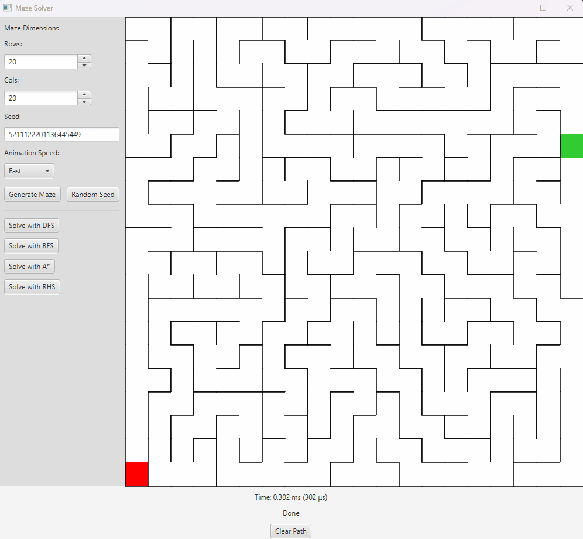

# Maze Generator & Solver System

A Java-based deterministic maze generator and solver suite demonstrating
algorithmic correctness, modular design, and requirements-driven software
engineering.



---

## Overview
This project implements a **perfect maze generator** along with multiple
maze-solving algorithms, including **Depth-First Search (DFS)**,
**Breadth-First Search (BFS)**, **Right-Hand Rule**, and **A\***.

The system emphasizes:
- Deterministic generation via seeded randomness
- Clear separation of concerns between generation, modeling, and solving
- Algorithm tradeoffs and correctness
- Testability and clean documentation

This repository serves as a **portfolio project** showcasing data structures,
graph traversal strategies, and practical software engineering practices.

---

## Features
- Perfect maze generation (fully connected, no cycles)
- Deterministic output using a seeded random number generator
- Multiple solver strategies:
  - DFS (depth-based traversal)
  - BFS (shortest-path guarantee)
  - Right-Hand Rule (wall-following strategy)
  - A* (heuristic-based shortest path)
- Shared maze representation across all solvers
- Solver visualization support (visited order + path)
- JUnit-based validation and edge-case testing

---

## Architecture
- **MazeGen package**
  - Core maze model (`Maze`, `Cell`, `Direction`)
  - Deterministic maze generation logic
- **Solvers package**
  - Independent solver implementations (DFS, BFS, RHS, A*)
  - Each solver operates on the same maze representation
- **Docs**
  - Requirements Analysis
  - Project planning (Gantt chart)

This structure enforces clean separation between core logic, solver behavior,
and presentation concerns.

---

## How to Run
### Requirements
- Java 17+ 
- Maven

### Build
```bash
mvn clean package
